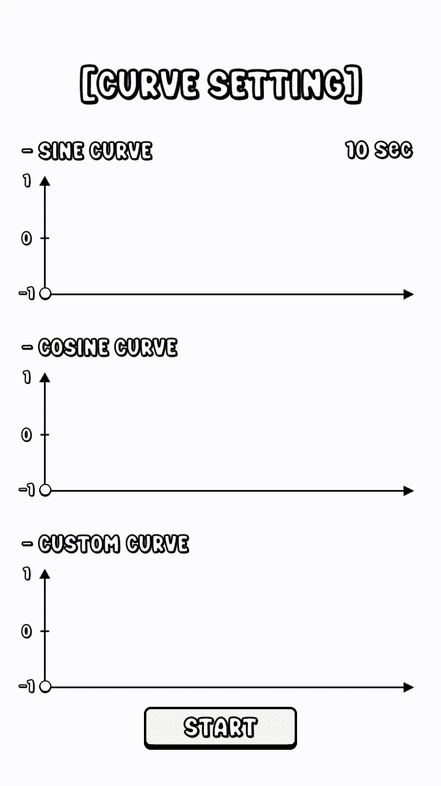
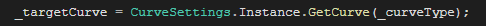

# CurveSettings

#### ⦁ [CurveSettings]은 게임에서 사용되는 'Animation Curve'를 반복해서 생성하지 않고, 저장된 데이터로 들고와 재활용할 수 있도록 만든 도구입니다.

#### ⦁ Version 1.0 (2023.09.02)

### 1. 데모 이미지

    

### 2. 조건

- [CurveSettings]는 어디서든 'Animation Curve'가 필요할 시 불러서 사용할 수 있어야 할 것

### 3. 메인 설계

- **Curve Settings 설계**

  - **[Curve Settings]는 기존에 저장된 데이터를 가져와서 사용**하며, 어디서든 편리하게 들고 올 수 있어야하기에 **Static으로 지정하고 받아올 수만 있도록 구현**
 
  - [Curve Type], [Animation Curve]의 컴포넌트만을 활용한 간단한 구현

  - **[CurveSettings](https://github.com/MinjunISAAC/CurveSettings/blob/main/CurveSettings/Assets/Utility/Settings/Scripts/Curve/CurveSettings.cs)**

- **기타**
  
  - **사용 법**

    1) 'Resources' 폴더안에 있는 'ScriptableObject'에 원하는 Curve를 등록 후, 'Animation Curve'를 수정
       
    2) 함수를 통해 불러오기
   

    

  - **피드백**

    1) **'Resources'에 저장되어있는 'ScriptableObject'가 손상이 되거나 삭제가 되었을 경우 기능이 정상 작동하지 않을 수 있음.**
   
    2) **만약 이 기능을 더 폭넓게 업그레이드 할 시, 'ECurveType'을 사용자가 생성, 삭제하는 기능을 [Custom Editor]로 개발할 경우 열거형의 Index가 꼬일 수 있음. -> 정상작동하지 않을 수 있음.**
